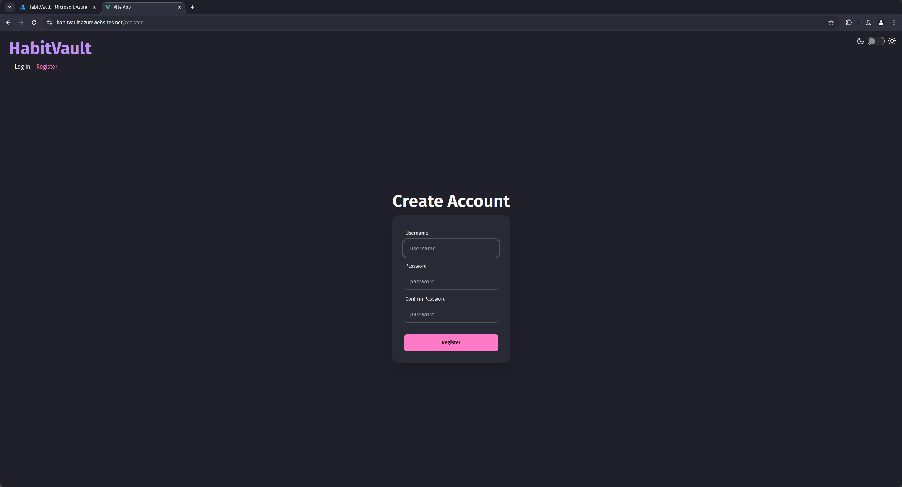
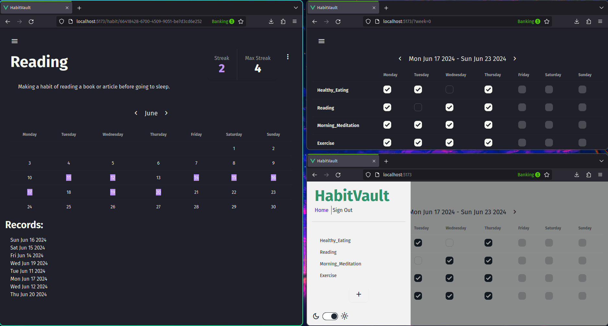

# HabitVault

Web‑based habit‑tracking application that keeps you accountable and visualises your progress.

## Features

- User Accounts
- Dashboard - Overview of habits, streaks, and stats.
- Custom Habits - Create, edit, and delete habits.
- Streak Tracking - Auto‑calculated daily streaks and maximum streak records.
- Admin user/panel - Manage users, ban or delete accounts.
- Light/dark theme

## Preview

</img>
</img>
</img>

## Architecture

- Frontend:
    - Vue.js 3
    - Axios
    - TailwindCSS
    - daisyUI
- Backend:
    - Express
    - Prisma
    - JWT

Database:
- MySQL - user and habit storing
- Redis - session store

## Run

[Devbox](https://www.jetify.com/devbox) is chosen because it guarantees a consistent development environment.

- Clone the repository and run `devbox run start-dp` or `docker compose up` to set up the MySQL database and Redis.
- Run `devbox run init` to set up the project environment, and run database migrations.
- To start backend run `devbox run start-backend`.
- To start frontend run `devbox run start-frontend`.
- Open <a href="http://localhost:5173/">http://localhost:5173/</a>

## License

This project is licensed under [MIT](LICENSE) License.
